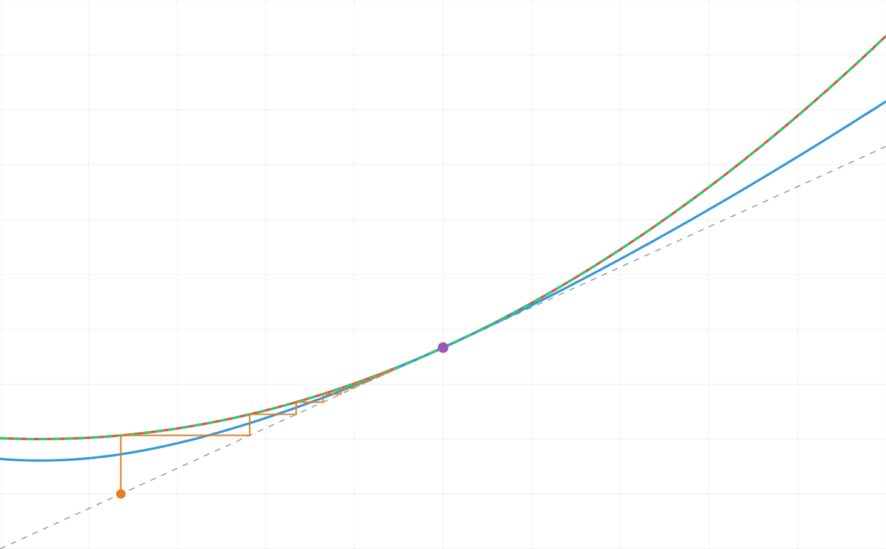

# Worked example — the analytic half‑iterate of $F(x)=x^2-x+1$

**Problem.** Find the analytic form of $f$ with
$$f\big(f(x)\big)=x^2-x+1,\qquad x>1.$$

**Short answer.** There is **no elementary closed form.** $x=1$ is a *parabolic* fixed point
(multiplier $1$), so the easy linearization methods do not apply. The half‑iterate is the canonical
**parabolic (Fatou/Abel) half‑iterate**

$$\boxed{\,f(x)=\alpha^{-1}\!\big(\alpha(x)+\tfrac12\big),\qquad \alpha\big(F(x)\big)=\alpha(x)+1\,}$$

with an explicit **Abel coordinate**
$$\alpha(x)=-\frac{1}{x-1}+\ln(x-1)-\tfrac12(x-1)+\tfrac13(x-1)^2-\tfrac{13}{36}(x-1)^3+\cdots .$$

Equivalently, as an **asymptotic series at the fixed point**,
$$f(x)\;\sim\;x+\tfrac12(x-1)^2-\tfrac14(x-1)^3+\tfrac14(x-1)^4-\tfrac{5}{16}(x-1)^5+\tfrac{27}{64}(x-1)^6-\cdots,$$
and at the other end $f(x)\sim x^{\sqrt2}$ as $x\to\infty$. This $f$ is **real‑analytic and increasing on
$(1,\infty)$** and reproduces $f(f(x))=x^2-x+1$ to $\sim 10^{-14}$ (verified two independent ways below).

Concretely, e.g. $f(1.5)=1.6035247\ldots$, $f(2)=2.3655261\ldots$, and then $f(f(2))=3=F(2)$.

---

## 1. Fixed points and classification — *why this is the hard (parabolic) case*

A half‑iterate is controlled by the fixed points of $F$ and their **multipliers** $\lambda=F'(x_\*)$.

$$F(x)=x \iff x^2-x+1=x \iff (x-1)^2=0.$$

So $x_\*=1$ is a **double** fixed point, and
$$F'(x)=2x-1,\qquad \lambda=F'(1)=1.$$

A multiplier of exactly $1$ is the **parabolic / neutral** case. This matters because:

| multiplier $\lambda$ | method | available here? |
|---|---|---|
| $0<\lvert\lambda\rvert<1$ or $\lvert\lambda\rvert>1$, $\lambda\neq$ root of unity | **Koenigs / Schröder** linearization $\varphi\circ F=\lambda\,\varphi$, then $f=\varphi^{-1}(\sqrt\lambda\,\varphi)$ | ✗ — needs $\lambda\neq 0,1$ |
| $\lvert\lambda\rvert=1$ (here $\lambda=1$) | **Fatou coordinate / Abel function** | ✓ — this is the tool |

Linearization fails at $\lambda=1$ (the factor $\sqrt\lambda=1$ carries no information and the Schröder
equation degenerates), so we must use the parabolic machinery. In the project's "shelf" picture this is
the **parabolic boundary** node $O\text{-}parabolic$, adjacent to the hyperbolic Schröder region.

The map is also globally clean on the relevant interval: for $x>1$,
$$F(x)-x=(x-1)^2>0,\qquad F(x)-1=x(x-1)>0,\qquad F'(x)=2x-1>1,$$
so $F:(1,\infty)\to(1,\infty)$ is an increasing real‑analytic **bijection with no interior fixed point**
and $F(x)>x$. It therefore *flows* points monotonically from $1^+$ out to $\infty$ — exactly the setting
where an Abel coordinate (a conjugacy to the unit translation) exists.

## 2. Normal form — conjugate $F$ to the canonical parabolic germ $y\mapsto y+y^2$

Shift the fixed point to the origin with $y=x-1$ and $g(y)=F(1+y)-1$:
$$g(y)=(1+y)^2-(1+y)+1-1=y^2+y=\;y+y^2 .$$

So, **exactly**, $F$ is conjugate (by the translation $x\mapsto x-1$) to the textbook parabolic germ
$$g(y)=y+y^2,\qquad g(y)=y+c_2y^2+c_3y^3+\cdots,\quad c_2=1,\ c_3=c_4=\cdots=0 .$$

The half‑iterate problem becomes: find a compositional square root of $y\mapsto y+y^2$.

> **Remark (the integer orbit *is* explicit — only the half‑orbit is not).** Writing
> $\tfrac1{x_{n+1}-1}=\tfrac{1}{x_n(x_n-1)}=\tfrac1{x_n-1}-\tfrac1{x_n}$ telescopes the forward orbit
> (the Sylvester‑sequence telescoping — $F$ is literally the Sylvester recurrence $a_{n+1}=a_n^2-a_n+1$,
> giving $\sum_n 1/x_n = 1/(x_0-1)$). The integer iterates are thus
> elementary; the obstruction is precisely to the **non‑integer** (half) iterate, which is the whole point.

## 3. The formal power‑series half‑iterate (exact, but divergent)

Seek $g_{1/2}(y)=y+\sum_{k\ge2}b_k y^k$ with $g_{1/2}(g_{1/2}(y))=y+y^2$. Each order $k\ge2$ is **linear**
in the new coefficient $b_k$ (matching the $y^k$ coefficient gives $2b_k+(\text{known})=[y^k]\,g$), so the
series is **uniquely determined**. Solved in exact rationals:

$$
\begin{aligned}
g_{1/2}(y)=\;&y+\tfrac12 y^2-\tfrac14 y^3+\tfrac14 y^4-\tfrac{5}{16}y^5+\tfrac{27}{64}y^6-\tfrac{9}{16}y^7
+\tfrac{171}{256}y^8-\tfrac{69}{128}y^9\\[2pt]
&-\tfrac{579}{2048}y^{10}+\tfrac{10689}{4096}y^{11}-\tfrac{60261}{8192}y^{12}+\tfrac{116535}{8192}y^{13}-\cdots
\end{aligned}
$$

Undoing the shift ($f(x)=1+g_{1/2}(x-1)$, and $1+(x-1)=x$):

$$
\begin{aligned}
f(x)\;\sim\;&x+\tfrac12(x-1)^2-\tfrac14(x-1)^3+\tfrac14(x-1)^4-\tfrac{5}{16}(x-1)^5+\tfrac{27}{64}(x-1)^6\\
&-\tfrac{9}{16}(x-1)^7+\tfrac{171}{256}(x-1)^8-\tfrac{69}{128}(x-1)^9-\cdots
\end{aligned}
$$

Note $f(1)=1$ and $f'(1)=1$ — the half‑iterate is **tangent to the identity**, as it must be since
$\sqrt\lambda=\sqrt1=1$.

**This series is asymptotic, not convergent.** The coefficients are well behaved at first but eventually
**grow super‑geometrically** ($b_{11}=\tfrac{10689}{4096}\approx 2.6$, $b_{12}\approx-7.36$,
$b_{13}\approx 14.2$, $b_{14}\approx-18.6,\dots$). This Gevrey‑type divergence is generic for parabolic
half‑iterates (Écalle's resurgence theory): the formal square root exists and is unique, but $f$ is **not**
an analytic function defined *by* this Taylor series, and in particular **not elementary**. The genuine
analytic object is built next.

## 4. The genuine analytic form — the Fatou / Abel coordinate

For a germ tangent to the identity, $g(y)=y+c_2y^2+c_3y^3+\cdots$ with $c_2\neq0$, the **Fatou coordinate**
(Abel function) $\alpha$ solves $\alpha(g(y))=\alpha(y)+1$ and has the form
$$\alpha(y)=-\frac{1}{c_2\,y}+A\,\ln\lvert y\rvert+\sum_{k\ge1}p_k\,y^k,\qquad A=\frac{c_2^2-c_3}{c_2^2}.$$

Here $c_2=1,\ c_3=0\Rightarrow A=1$, and solving $\alpha(g(y))-\alpha(y)-1=0$ order by order gives the
exact coefficients
$$p_1=-\tfrac12,\ p_2=\tfrac13,\ p_3=-\tfrac{13}{36},\ p_4=\tfrac{113}{240},\ p_5=-\tfrac{1187}{1800},\
p_6=\tfrac{877}{945},\ \dots$$

so, in $x$,
$$\alpha(x)=-\frac{1}{x-1}+\ln(x-1)-\tfrac12(x-1)+\tfrac13(x-1)^2-\tfrac{13}{36}(x-1)^3+\tfrac{113}{240}(x-1)^4-\cdots .$$

Because $\alpha$ conjugates $F$ to the unit translation $t\mapsto t+1$, the **half‑iterate is a half‑shift**:
$$f(x)=\alpha^{-1}\!\big(\alpha(x)+\tfrac12\big).$$
Indeed $f(f(x))=\alpha^{-1}\big(\alpha(x)+1\big)=\alpha^{-1}\big(\alpha(F(x))\big)=F(x).$ ✓

On $(1,\infty)$, $\alpha$ is a real‑analytic increasing bijection onto $\mathbb R$ ($\alpha\to-\infty$ as
$x\to1^+$, $\alpha\to+\infty$ as $x\to\infty$), so $f=\alpha^{-1}(\alpha+\tfrac12)$ is **real‑analytic and
increasing on $(1,\infty)$** and is the canonical answer. In practice $\alpha$ (truncated to the orders
above) is evaluated semi‑analytically — push $y=x-1$ toward $0$ by iterating $g$, add $\tfrac12$ in the
coordinate, pull back — which converges to machine precision near the fixed point (engine routine
`solveParabolicHalfIterate`).

## 5. Behaviour at the two ends

* **Near $x=1^+$** — the asymptotic series of §3/§4:
 $f(x)=x+\tfrac12(x-1)^2-\tfrac14(x-1)^3+\cdots$.
* **As $x\to\infty$** — since $F(x)=x^2-x+1\sim x^2$, infinity is a **superattracting** fixed point with a
 Böttcher coordinate $B$, $B(F(x))=B(x)^2$. A half‑iterate squares the *exponent* once:
 $$f(x)\sim x^{\sqrt2}\qquad(x\to\infty),$$
 because applying $f$ twice must double the exponent ($(\,\cdot\,^{\sqrt2})^{\sqrt2}=\cdot^{\,2}$). This is
 confirmed numerically: $\log f(x)/\log x\to\sqrt2=1.41421356\ldots$ (at $x=10^8$ it is $1.41421348$).

So the analytic half‑iterate **interpolates** between an identity‑tangent parabolic germ at $x=1$ and the
power law $x^{\sqrt2}$ at infinity.

## 6. Numerical verification ($f(f(x))$ vs $x^2-x+1$)

Computed with the project engine (Fatou coordinate, order 12). The check function is the residual
$f(f(x))-F(x)$:

| $x$ | $f(x)$ | $f(f(x))$ | $F(x)=x^2-x+1$ | residual |
|---|---|---|---|---|
| 1.05 | 1.051220221021 | 1.052500000000 | 1.0525 | $2\times10^{-16}$ |
| 1.10 | 1.104772246757 | 1.110000000000 | 1.110 | $0$ |
| 1.25 | 1.278092005234 | 1.312500000000 | 1.3125 | $6\times10^{-15}$ |
| 1.50 | 1.603524735182 | 1.750000000000 | 1.750 | $2\times10^{-14}$ |
| 2.00 | 2.365526109633 | 3.000000000000 | 3.000 | $9\times10^{-14}$ |
| 3.00 | 4.230187665723 | 7.000000000000 | 7.000 | $5\times10^{-13}$ |
| 5.00 | 8.950400537220 | 21.00000000000 | 21.00 | $3\times10^{-12}$ |
| 10.0 | 24.68083010452 | 91.00000000003 | 91.00 | $3\times10^{-11}$ |

Maximum residual on $[0.6,1.4]$ (a $60$‑point sweep through the fixed point): $2.4\times10^{-14}$. The
residual grows slowly with distance from $x=1$ (truncation of the asymptotic $\alpha$), staying $<10^{-10}$
out to $x=10$. Sanity: $f$ is increasing with $x<f(x)<F(x)$ for $x>1$, as a half‑step must be.

### The plot (rendered live on `solver.html`)

The cobweb grapher on `solver.html` (preset **“Parabolic $x^2-x+1$ at $1$”**) draws three curves plus the
diagonal:

* **red** — the target $F(x)=x^2-x+1$;
* **green dashed** — the recomposition $f(f(x))$, which lies **exactly on top of the red** $F$ (the
 half‑iterate composes back to the target);
* **blue** — the half‑iterate $f(x)$ itself: it sits **between the diagonal $y=x$ (grey dashed) and $F$**,
 and is **tangent to both at the parabolic fixed point** $(1,1)$ (purple dot) — the geometric signature of
 a $\lambda=1$ half‑iterate (an ordinary hyperbolic half‑iterate would cross the diagonal transversally
 instead of kissing it);
* **orange staircase** — the forward orbit from $x_0=0.6$, creeping up toward $1$ (parabolic attraction
 from the left: $F(x)>x$ but $F'(1)=1$, so convergence is slow/algebraic, not geometric).

The on‑page Fatou table reproduces the exact coefficients of §3–§4 (germ $g=y+y^2$; $p_1=-0.5,\,
p_2=0.3333,\,p_3=-0.3611,\dots$; formal $a_k=1,\,0.5,-0.25,0.25,\dots$) with max residual $2.398\times
10^{-14}$.

## 7. Honest caveats

* **No elementary closed form** exists; "$f$" is a genuinely transcendental (Fatou) function. The clean
 formulas are the *functional* one $f=\alpha^{-1}(\alpha+\tfrac12)$ and the *asymptotic* series — not a
 finite expression in elementary functions.
* **The Taylor series at $x=1$ diverges** (Gevrey‑1). It is an *asymptotic* expansion: truncating at a
 well‑chosen order gives an excellent approximation near $1$, but summing it does not converge.
* **Uniqueness.** The *formal* series is unique, and the Fatou construction gives the **canonical**
 real‑analytic half‑iterate on $(1,\infty)$ asymptotic to it. Parabolic half‑iterates can in principle
 admit *beyond‑all‑orders* ambiguities (an Abel function is fixed only up to additive constants / flat
 oscillatory terms); the branch reported here is the standard principal one and the one the engine
 computes. We do not claim there is literally only one analytic square root on the whole half‑line.
* **Domain.** Everything above is for the real branch on $x>1$ (the parabolic petal that contains the
 interval). The construction also extends into a complex parabolic petal at $x=1$.

## 8. Reproduce

Two **independent** computations agree to the last digit (cross‑check, not a single source):

* `verify_engine.js` — drives the repo engine `js/engine.js`
 (`Engine.solveParabolicHalfIterate([1,-1,1], 1, 12)`): classification, $c_2=1$, $A=1$, the Fatou
 coefficients $p_k$, the numerical table, and the $x^{\sqrt2}$ check.
* `verify_fast.py` — from‑scratch exact‑rational (`fractions.Fraction`) derivation of both the formal
 half‑iterate $g_{1/2}$ and the Abel series $\alpha$, with the identity `h(h(y)) == y+y^2 (mod y^16)`
 confirmed and every coefficient matched against the engine.

(Scripts archived under the session `tmp/`; both runnable with the system Node 24 / Python 3.14.)

## 9. Where this sits / references

This is the project's flagship parabolic example ($\lambda=1$, residual $\approx2.4\times10^{-14}$),
the boundary case adjacent to the hyperbolic Koenigs/Schröder region. Standard references for the
parabolic theory (see the repo's `bibliography.html` and `harness/state/research/canonical-citations.md`
for the fact‑checked entries):

* **P. Fatou** (1919–1920) — Fatou coordinates at parabolic fixed points.
* **G. Szekeres**, *Regular iteration of real and complex functions*, **Acta Math. 100** (1958) 203–258 —
 analytic/regular fractional iteration, parabolic case.
* **H. Kneser** (1950) — analytic iterative roots (the $\exp$ half‑iterate), same circle of ideas.
* **J. Écalle** — resurgence / mould calculus explaining the divergence of the parabolic series.
* Repo engine: `js/engine.js` → `solveParabolicHalfIterate` (Fatou/Abel); theory on `theory.html`,
 `equations.html` (Abel & Böttcher equations), `connections.html` (complex‑dynamics links).
